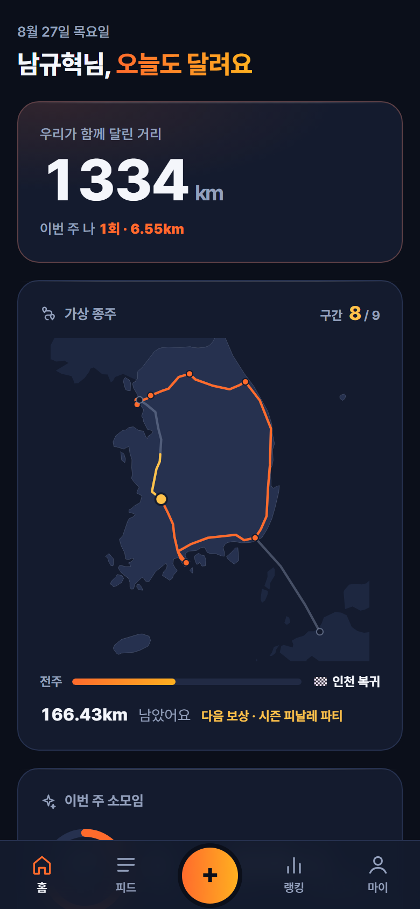
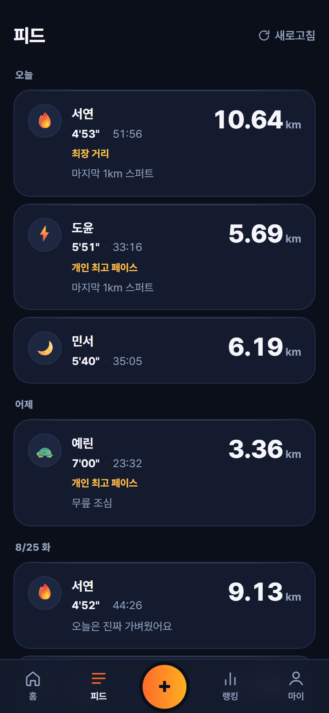
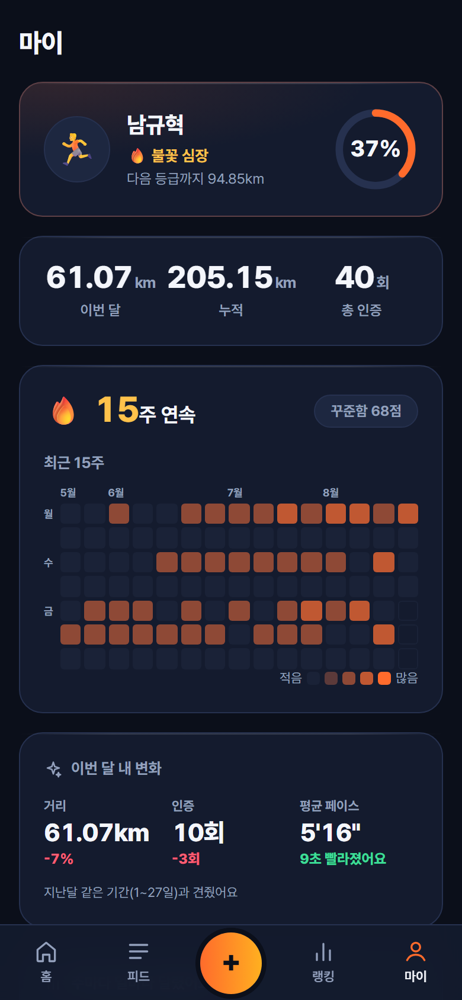
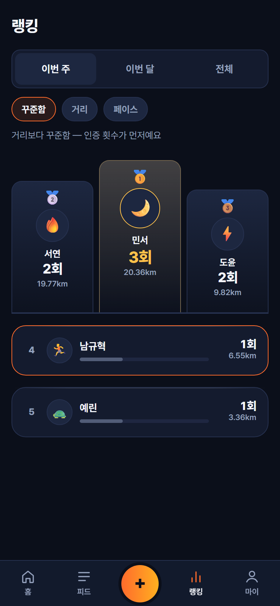
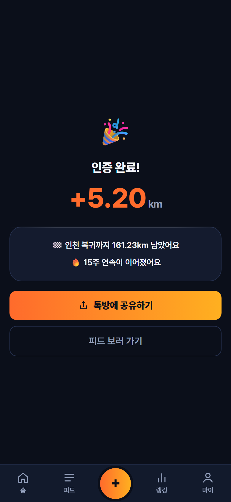

# Deep Running

인하대 인공지능공학과 러닝 소모임 **Deep Running**(7명)의 인증 기록을 한곳에 모으는 모바일 웹입니다.

**→ https://ngh3651.github.io/deep-running/** (폰으로 여세요. 이름과 숫자 4자리만 정하면 바로 시작됩니다)

각자 나이키런클럽·삼성헬스로 달리고 톡방에 스크린샷으로 "오늘도 달렸습니다"를 올리는데, 그 인증이 톡방에 흘러가 버려 아무것도 쌓이지 않는 게 아쉬웠습니다. 그래서 개인 기록 측정은 기존 러닝앱에 그대로 맡기고, **소모임에만 있는 재미** — 누적 거리로 전국을 종주하고, 거리가 아니라 꾸준함으로 순위를 매기고, 주간 스트릭이 끊기지 않게 서로 눈치를 주는 것 — 만 담았습니다.

랭킹 1순위가 거리가 아니라 **인증 횟수**인 건 의도입니다. 7명짜리 모임에서 거리로 줄을 세우면 하위 세 명이 매주 바닥에 있는 자기 이름을 보게 되고, 그 사람들이 조용히 나갑니다.

## 화면

| 홈 — 가상 종주 | 피드 | 마이 |
|---|---|---|
|  |  |  |

| 랭킹 | 올린 직후 |
|---|---|
|  |  |

## 기능

- **로그인** — 이름 + 숫자 4자리. 회원가입 화면이 없고, 처음 친 조합이 곧 계정입니다.
- **인증 업로드** — 러닝앱 기록 화면을 고르면 브라우저에서 OCR로 거리·시간을 읽어 폼을 채우고, "3.01km · 16:49 을 읽었어요"라고 **확인**을 받습니다. 거리 퀵칩, 평소 페이스로 시간 추정, 오늘/어제 칩이 있어서 사진 없이도 몇 초면 끝납니다. **사진은 저장하지 않습니다** — 숫자만 읽고 바로 버립니다.
- **올린 직후 보상 화면** — 종주가 얼마나 남았는지, 스트릭이 몇 주가 됐는지, 새 뱃지를 땄는지. 내 기록이 소모임을 새 도시에 닿게 했으면 도착 축하가 크게 뜹니다.
- **톡방 공유 카드** — canvas로 그린 1080×1080 인증 카드를 공유 시트로 넘깁니다. 웹에 올리고 톡방에 공유하면 되니 이중 업로드가 사라집니다.
- **기록 고치기·지우기** — OCR이 잘못 읽었으면 나중에 바로잡습니다.
- **피드** — 날짜별로 묶인 최신 50건. 기록마다 그 사람의 평소와 견준 한마디(`개인 최고 페이스`, `평소보다 12초 빨랐어요`)와 응원 하트.
- **마이** — 등급, 15주 잔디, 이번 달 변화, 주간 거리·페이스 그래프, 최고 기록, **에딩턴 수**, 뱃지 12개, 소모임 평균과의 비교.
- **랭킹** — 이번 주/이번 달/전체 × 꾸준함/거리/페이스/케이던스. 3명부터 시상대가 섭니다.
- **홈** — 소모임 누적 거리, 가상 종주 지도, 이번 주 요약, 그리고 톡방 멤버 목록처럼 보이는 소모임원 현황.
- **건의함** — 소모임장에게 바로 갑니다.
- **홈 화면에 추가** — 아이콘으로 열리는 앱처럼 동작합니다.

## 다른 러닝앱이 안 보여주는 것

- **에딩턴 수** — `n km 이상 달린 날이 n일` 을 만족하는 가장 큰 수. 한 번 멀리 달려서는 안 오르고 자주 달려야 올라서, "다음 숫자까지 세 번"이 저절로 퀘스트가 됩니다.
- **꾸준함 점수** — 주간 인증 횟수의 변동계수. 매주 비슷하게 달릴수록 100점. 아예 안 달린 사람이 편차 0으로 만점을 받지 않도록 평균이 주 1회 미만이면 점수를 매기지 않습니다.
- **같이 달린 날** — 두 명 이상이 같은 날 달린 날의 수. 7명짜리 모임에서만 의미가 있는 숫자입니다.
- **5km 예상 기록** — Riegel 환산(`T₂ = T₁ × (D₂/D₁)^1.06`). 3km 뛴 사람과 12km 뛴 사람을 같은 축에서 봅니다. 레이스 전제 공식이라 순위엔 쓰지 않고 개인 추이로만 씁니다.
- **가상 종주** — 소모임 누적 거리가 인하대 → 송도 → 서울 → 춘천 → … → 후쿠오카 루트를 따라 **실제 지도 위에서** 나아가고, 도시마다 회식 같은 보상이 걸립니다. 지도는 Natural Earth(퍼블릭 도메인) 외곽선을 미리 SVG로 변환해 저장소에 넣어둔 것이고 경로 좌표도 상수입니다 — 지도 라이브러리도, 런타임 지도 호출도 없습니다.

## 스택 · 아키텍처

Vite + React + TypeScript로 만든 순수 클라이언트 앱이고, 서버 코드가 한 줄도 없습니다. 데이터는 브라우저에서 supabase-js로 Supabase Postgres에 직접 붙고(Storage는 쓰지 않습니다 — 사진을 안 남기니까), 배포는 GitHub Actions가 `main` push마다 GitHub Pages로 올립니다. 새로고침 404를 피하려고 라우터는 HashRouter를 쓰고 Vite `base`는 `'./'`로 두었습니다.

**저장하는 건 이름·날짜·거리·시간·메모·케이던스뿐입니다.** 페이스·스트릭·누적·랭킹·잔디·뱃지·등급·에딩턴 수는 전부 매번 계산해서(`src/lib/calc.ts`, `src/lib/stats.ts`) 기록을 지우면 숫자도 정확히 되돌아갑니다. 소모임 데이터는 `src/lib/store.ts`(모듈 변수 + `useSyncExternalStore`, 40줄)에서 한 번만 받아 모든 화면이 나눠 쓰기 때문에 탭을 옮길 때 스피너가 돌지 않습니다.

**차트·아이콘·공유 카드·PWA를 넣으면서 의존성은 하나도 늘지 않았습니다.** 막대·잔디·추이 선·원형 진행률은 CSS 격자와 인라인 SVG, 아이콘 20개는 24×24 격자에 직접 그린 path, 공유 카드는 canvas 2D, 홈 화면 아이콘은 `scripts/icons.mjs`가 한 번 구워 커밋합니다. 색도 마찬가지로 새 hex를 만들지 않고 `color-mix`로 기존 토큰에서 파생시켰습니다.

스키마가 필요한 기능(케이던스·건의함·응원)은 **DB에 아직 칸이 없어도 앱이 멀쩡히 돌아가게** 만들었습니다. `src/lib/store.ts`의 `probeCaps`가 한 번 물어보고, 없으면 그 기능을 조용히 감춥니다. 건의함은 테이블이 없는 동안 클립보드로 떨어져서 톡방에 붙여넣을 수 있습니다.

비밀번호는 `SHA-256(이름 + ':' + 숫자4자리)`를 WebCrypto로 브라우저에서 해싱해 저장합니다. 4자리 숫자는 1만 가지뿐이고 anon 키도 공개 전제라 **링크를 아는 사람은 이론상 남의 이름으로 들어올 수 있습니다.** 7명 신뢰 기반 동아리 도구이고 서버에 남는 게 숫자뿐이라 의도한 트레이드오프이며, 링크는 톡방에만 공유합니다.

## 실행법

```bash
npm install
npm run dev       # 개발 서버
npm run verify    # 타입 검사 · 유닛 테스트 · 규율 검사 · 빌드  ← 이거 하나면 됩니다
npm run shots     # 전 화면 스크린샷 → .shots/contact.png 로 한 장에 모아 봅니다
npm run guard     # 파일 구조 · 토큰 밖 색 · 영어 문구 · 의존성 화이트리스트 검사
```

`npm run shots`는 Playwright로 Supabase REST 응답을 가로채 가짜 데이터를 물립니다. **운영 DB를 건드리지 않고** 데이터가 가득 찬 상태와 실제와 같은 1명·1건 상태를 둘 다 찍습니다. `.claude/agents/`에는 스크린샷을 보는 디자인 검토관, 한국어 문구 검사관, 스펙 감사관이 있습니다.

DB는 `supabase/migrations/`의 SQL을 번호 순서대로 Supabase SQL Editor에서 실행하면 됩니다.

## 결정 로그

스펙에 없어서 직접 정한 것들입니다.

- `@types/react`, `@types/react-dom`을 의존성 화이트리스트 밖에서 추가했습니다. TS+React에서 타입 검사가 아예 돌지 않아 타입 전용 패키지로 예외를 뒀습니다.
- Supabase 키는 레거시 anon JWT 대신 publishable 키(`sb_publishable_…`)를 씁니다.
- 확인 다이얼로그는 `window.confirm` 대신 앱 안에서 그립니다. 문구를 한국어로 통제하고 다크 토큰을 유지하려고요.
- 조사(`으로`/`로`, `이`/`가`)는 `src/lib/ko.ts`에서 계산합니다. 값이 바뀌는 자리 뒤에 조사를 하드코딩하면 반드시 틀립니다.
- OCR 전에 사진을 1280px로 줄이고 JPEG로 바꿉니다. 인식 속도가 몇 배 빨라집니다.
- OCR이 시간과 페이스를 가르는 기준은 "이미 읽은 거리로 나눈 페이스가 2'30"~15'00"에 들어오는가"입니다.
- **케이던스는 OCR로 읽지 않습니다.** 숫자만 읽는 whitelist로는 `172 spm`과 `172 kcal`과 심박수를 가를 수 없고, 잘못 채우면 사용자가 모르는 채 틀린 값이 저장됩니다.
- 사진 첨부는 선택입니다. 저장하지 않으니 필수로 둘 근거가 없습니다.
- 지도는 Natural Earth 50m(퍼블릭 도메인)에서 뽑아 메르카토르로 투영하고 Douglas–Peucker로 단순화해 `src/assets/korea.svg`(4.7KB)로 커밋했습니다. 런타임에 변환하지 않습니다.
- 마지막 구간(인천 복귀 → 후쿠오카)의 선은 인천이 아니라 **부산**에서 뽑았습니다. 1700km라는 숫자 자체가 "부산에서 직선 200km" 기준입니다.
- 펜 애니메이션은 `pathLength="1"`로 경로 길이를 정규화해서 씁니다.
- 터치 영역은 44×44를 최소로 잡았습니다.
- `prefers-reduced-motion`을 켠 사람에게는 모든 애니메이션을 끄고 최종 상태만 보여줍니다. 로딩 스피너는 상태 표시라 남깁니다.
- 목록을 못 불러왔을 때 빈 배열로 뭉개지 않고 "불러오지 못했어요"로 따로 알립니다.
- 데모 시드는 인수 전에 멤버·기록을 **전부** 지웠습니다.

### 밤샘 개편에서 정한 것 (2026-08-27)

- **지도에 도시 이름을 얹지 않습니다.** 390px에서 라벨이 겹치고, 어차피 지도 아래 한 줄에서 읽힙니다. 지도 높이는 300px로 묶었습니다 — 한국은 세로로 긴 나라라 그대로 두면 화면 절반을 먹습니다.
- **종주 카드 머리의 숫자는 `구간 1 / 9`입니다.** 전체 진행률 %를 쓰면 초반에 늘 `0%`라 읽을 게 없고, 지도가 보여주는 전국과 아래 막대가 보여주는 한 구간이 서로 다른 걸 가리켜 헷갈립니다.
- **소모임원 목록에 등수를 붙이지 않습니다.** 이번 주에 달린 사람이 위로 오고, 안 달린 사람은 흐리게만 합니다. X 표시나 빨간색은 쓰지 않습니다.
- **랭킹에서 내 행은 테두리로만 표시합니다.** 같은 값인데 막대 색이 다르면 색이 "더 잘함"으로 읽힙니다.
- **느렸다는 말을 만들지 않습니다.** 피드 한마디는 개인 최고·평소보다 빠름·평소보다 멀리만 있고, 나빠진 값은 빨강이 아니라 회색입니다. 빨강은 지우기와 실패에만 씁니다.
- **이번 달 변화는 지난달 *같은 날짜까지*와 견줍니다.** 27일에 이번 달 27일치를 지난달 31일치와 비교하면 매달 초에 전원이 퇴보한 것처럼 보입니다.
- **값이 0인 주에 색 조각을 남기지 않습니다.** `min-height`로 남은 주황 조각이 "조금은 달렸다"로 읽혔습니다. 회색 2px 바닥선으로 바꿨습니다.
- **기록 고치기는 `새로 넣고 → 옛 걸 지운다`입니다.** `runs`에 update 정책이 없기도 하고, 반대 순서면 네트워크가 끊겼을 때 기록이 증발합니다. 이 순서면 최악이라도 같은 기록이 두 개 남고 그건 지울 수 있습니다.
- **소모임장은 이름을 코드에 박지 않고 가장 먼저 가입한 멤버로 판별합니다.**
- **기능 탐지는 `suggestions` 테이블 하나만 물어봅니다.** 0003이 케이던스·건의함·응원을 한꺼번에 넣으니 하나만 확인하면 되고, 없는 걸 세 번 물으면 콘솔에 404가 세 번 찍힙니다.
- **서비스 워커는 넣지 않았습니다.** 오프라인 이득보다 낡은 앱이 캐시에 남아 디버깅이 어려워지는 위험이 큽니다. manifest만으로도 홈 화면 추가는 됩니다.
- **백분위 표시를 뺐습니다.** 7명에선 순위와 수학적으로 같은 말이라 새 정보가 없습니다. 값을 나란히 놓는 비교 막대로 대신했습니다.
- **VO2max·ACWR 같은 지표를 일부러 뺐습니다.** 전력 레이스를 전제한 공식이라 동네 조깅 데이터를 넣으면 전원이 저평가됩니다.
- **스트릭이 끊긴 주에 대한 문구를 바꿨습니다.** 원래 스펙의 "이번 주 아직 안 달렸어요 — 불꽃이 꺼지기 전에!"는 안 한 걸 지적합니다. "이번 주에 한 번만 올리면 불꽃이 이어져요"로 바꿨습니다.
- **SPEC 11장이 CLAUDE.md를 통째로 베껴 담고 있던 걸 걷어냈습니다.** 같은 내용을 두 문서에 적으면 어긋나기 시작하고, 그때 어느 쪽이 맞는지 아무도 모르게 됩니다.
